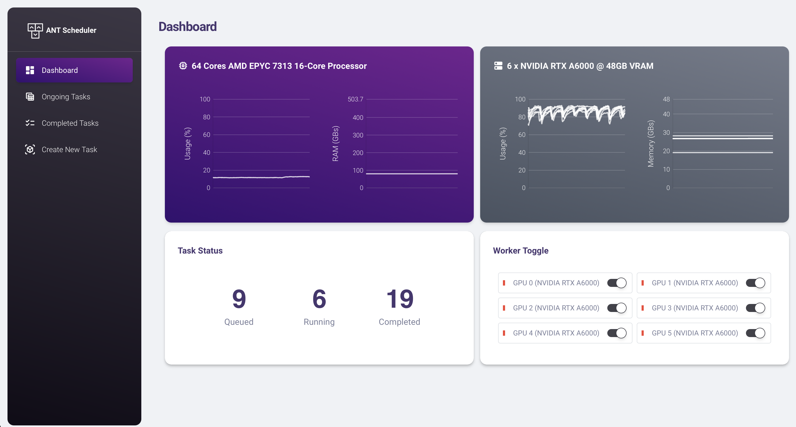

<center> <h1>ANT: GPU Scheduler</h1> </center>


Currently, ANT supports single-node multi-GPU settings, with multi-node support planned for future development.

The primary objective of ANT is to efficiently schedule jobs and allocate the requested GPU resources.

# Getting Started with ANT
ANT is built and tested with the following dependencies:
| Package | version |
| - | - |
| Python | >= 3.8 |
| Node.js | v24.4.1 | 
| npm | 11.4.2 | 
| OpenSSL | 3.0.17 |

### Installing
Assuming you have a conda installation, the necessary environment can be created by running:
```
conda create -n ant2 python=3.11 conda-forge::nodejs==24.4.1 -y
conda activate ant2
pip install -r requirements.txt
bash setup.sh
```
`setup.sh` will build the frontend and generate necessary certificates.

### Launching
Finally, launch ANT using:
```
python run.sh [gpu_ids separated by comma]

# Example (Selecting the first 4 GPUs):
python run.py  0,1,2,3
```
By default, this will load the configuration from `config/default.json` and host a web interface at `https://0.0.0.0:6060`. The backend status can be checked by curling as follows:
```
curl --insecure https://0.0.0.0:6060/api
```

### Test Run 
Head over to the `Create New Task` tab and type the following in the `commands` box:
```
echo "Hello World from ANT!"
```
Hit the `SUBMIT` button and watch your commands got executed! ANT will also automatically save your stdout logs (similar to using `tee` or `>>`). Under default configurations, the logs will be saved at `./ant_runner_logs`.

Intuitively, you can view all ongoing and completed tasks in their respectives tabs. There, you can easily view terminal logs, download, copy-commands, etc.

# Usage Guide
## Basic

ANT supports any single-line command. For sequential execution of multiple commands, please use `&&`.

> If your conda environment is necessary for your job, please use `conda run` instead of `conda activate`. Example: 
```
cd /path/to/my/project && conda run --live-stream -n my_env python ...
```
Note that `--live-stream` is necessary for the `conda run` to live-stream the output to stdout. Otherwise, no output will be printed.

## Advanced
#### Built-in RNG
ANT features a built-in randomizer, particularly useful for distributed training that requires assigning a specific port.
```
# Randomizing integer
{rand int 4000 5000}

# Randomizing float
{rand float 1.45 5.65}

# Note that this syntax can be substituted like an f-string in your commands. Example:
PORT={rand int 4000 5000} python myscript.py
python myscript.py --seed {rand float 3.4 6.4}
```

#### Queue Multiple Commands
ANT also support queuing multiple commands. To achieve this, select the "Multi" queue mode in the `Create New Task` page. Multiple commands can be seperated using new lines & each command can be extended to the following lines by adding `\` at the end (just like you would on terminals). Lines with leading `#` will be ignored.  

To configure running parameters, there two arguments can be used:
`ant_n_gpus : int = 1` & `ant_task_id : str = uuid.uuid4()`

```
# Running three commands with partially-defined parameters:
ant_n_gpus=4 ant_task_id="first_task" python first_task_.py \
--dataset my_dataset \
--batch_size 4
ant_n_gpus=2 python second_task.py \
--batch_size 8
python thrid_task.py
```
>Note that if multiple ANT arguments present, the only the last one will take effect. If none is present, the default value (randomized task_id & 0 n_gpus) will be used

#### Special environment variable
In previous versions of ant, commands can be very long and tedious to set up, hence we have integrated several special environment variables to improve QOL.

| Variable | Goal | What it actually does| Defaults |
| - | - | - | - |
| `ant_task_id` | set task id | will override `Task ID` input in `Single` queue mode | `uuid.uuid4()` |
| `ant_n_gpus` | set task id | will override `Number of GPUs` input in `Single` queue mode | 0 (can be adjusted in config) |
| `ant_wd` | set the working directory of the script | invoke `cd` before your command | `./` |
| `ant_conda_env` | set / activate a conda environment | invoke `conda run` before your command | `None` |
| `ant_conda_path` | change conda executable path | invoke the specified conda executable.  Should point to `your/path/bin/conda`| `conda` |

Hence, instead of appending:
```
cd /my/work/dir && /home/anaconda/bin/conda run --live-stream -n my_env mycommand
```
You can simply use the following environment variable in the `Create New Task` page:
| Variable | Value |
| - | - |
| `ant_wd` | `/my/work/dir` |
| `ant_conda_env` | `my_env` |
| `ant_conda_path` | `/home/anaconda/bin/conda` |

Environment variables will be saved internally and applied to all commands if `Multi` Queue mode is selected.

#### [HIGHLY EXPERIMENTAL] Auto Detect GPU Status (ADGS)
This feature monitors GPU usage and detects if a GPU is being utilized by processes outside of ANT. If the GPU's average usage or memory utilization exceeds 50% for a consecutive 20-second period, ANT will mark the GPU as BUSY.

Enable this behavior by setting `ADGS_enabled=true` in your config. This feature is not enabled by default.

## Future Update:
- Multi-node support

## Changelog:
| Version | Changelogs |
| -       | -          |
| 1.0.2 (current)   | - [new feature] Agent (codex) integration. ask your favourite agent to read and install `./skills`.<br>- [new feature] Added full_log flag to /get_log, allowing user to request full raw logs when needed.<br>- [new feature] Added bulk actions in Completed Task (select, bulk delete, bulk restart, bulk download log).<br>- Improved mobile support for Ongoing Task, Completed Task, and Task Log pages. they're actually usable on phones now.<br>- Improved general UI readability.<br>- Fixed several frontend layout bugs and overflow issues across desktop/mobile views.<br>- Fixed several bugs on backend log parsing.<br> |
| 1.0.1 | - [new feature] Improved Copy Command. Now copied the properties as well, (n_gpus, task_id, envar)<br>- [new feature] Added task restart button.<br>- Patched directory traversal attack on `task_id`<br>- Fixed several frontend bugs (text-overflow and wrong error message)<br>- Frontend task actions (copy, delete, kill, etc) refactor and cleanup (toasts) |
| 1.0.0 | - Massive rewrite.<br>- Switched to react.js frontend.<br>- Reimplement backend as a REST API & improved stability.<br>- Added GPU Toggle to disable specific GPUs.<br>- Added Environment Variable editor & its custom functions.<br>- Added `monitor` component that polls hardware info & status in an async manner. Deprecated `sysinfo.py`<br>- Added `AntTask` structure for tasks allowing seamless and integrated property tracking (time taken, envar, etc).<br>- Added launcher `run.py` to start & restart frontend & backend.<br>- Redesigned `Completed Task` page. It's actually practical now.<br>- fixed random bugs & added more safeguards (e.g. removing illegal characters in `task_id`, rejecting duplicate `task_id`, etc)<br>- Bunch of new QoL (e.g. more detailed message in toasts, etc.) |
|0.3.1 | - Now host HTTP and HTTPS server with proper redirecting. <br> - Deprecated `port` argument & replaced it with `port_http` & `port_https` <br> - Implemented faster log truncation algorithm to prevent unresponsive webserver. |
|0.3| - Added Auto GPU Availability Detection<br>- Added Mutliple Command Support<br>- Added QOL features to Flask UI (better notification, copy commands, view logs in browser, etc.)<br>- Forced HTTPS |
|0.2| - Updated Flask Visualizer UI <br> - Added advanced sytem monitoring (graphs & statistics)<br>- Set `ant.handler.subprocess_handler` as default.<br>- Deprecated `ant.handler.tmux_handler`<br>- Deprecated `ant.visualizer.ncurse_visualizer`|
|0.1| - Initial release|

## Acknowledgement
Web Template: [Creative Tim](https://www.creative-tim.com/product/material-dashboard).


