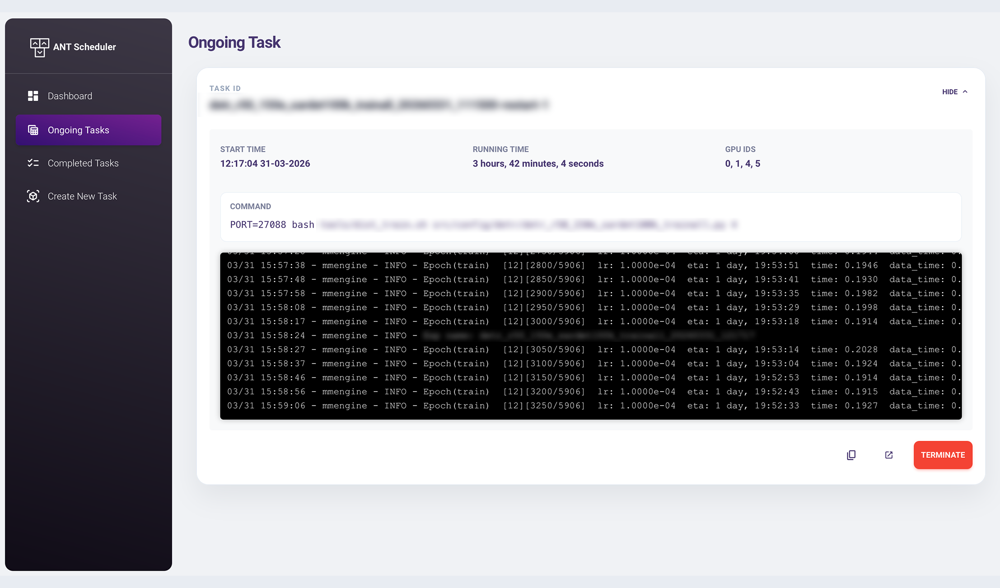
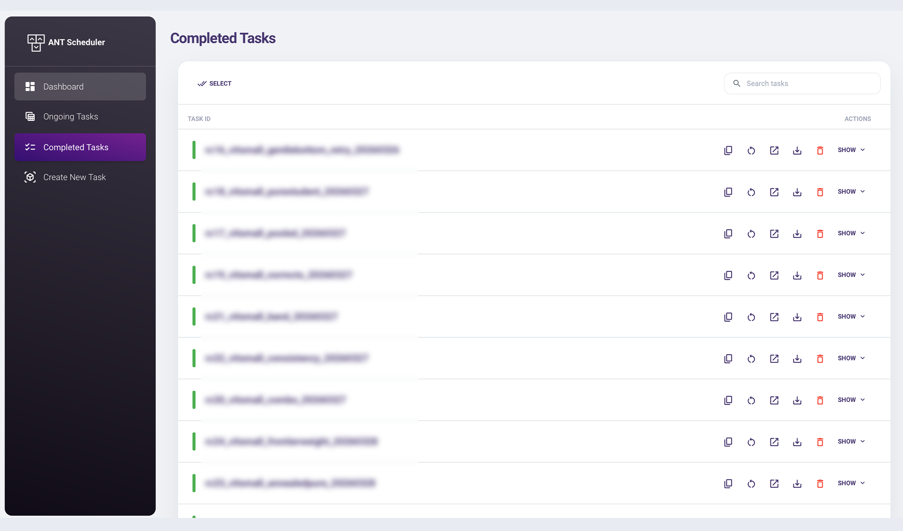

<center> <h1>ANT: Job Scheduler</h1> </center>


<div style="display: flex;">
  
  
</div>

Currently, ANT supports single-node multi-GPU settings, with multi-node support planned for future development.

The primary objective of ANT is to efficiently schedule jobs and allocate the requested GPU resources.

# Getting Started with ANT
ANT is built and tested with the following dependencies:
| Package | version |
| - | - |
| Python | >= 3.8 |
| Node.js | v24.4.1 | 
| npm | 11.4.2 | 
| OpenSSL | 3.0.17 |

### Installing
Assuming you have a conda installation, the necessary environment can be created by running:
```
conda create -n ant2 python=3.11 conda-forge::nodejs==24.4.1 -y
conda activate ant2
pip install -r requirements.txt
bash setup.sh
```
`setup.sh` will build the frontend and generate necessary certificates.

### Launching
Finally, launch ANT using:
```
python run.py [gpu_ids separated by comma]

# Example (Selecting the first 4 GPUs):
python run.py  0,1,2,3
```
By default, this will load the configuration from `config/default.json` and host a web interface at `https://0.0.0.0:6060`. The backend status can be checked by curling as follows:
```
curl --insecure https://0.0.0.0:6060/api/
```

### Configuration Reference
ANT reads its runtime settings from `config/default.json`. The shipped file controls three different layers at once: the process layout, the scheduler/runtime behaviour, and the UI/logging defaults.

Current sample config:

```json
{
  "backend_port": 5000,
  "frontend_port": 6060,
  "step_interval": 1,
  "logger": "default_logger",
  "loader": "memory_loader",
  "handler": "subprocess_handler",
  "runner": "gpu_runner",
  "visualizer": "flask_visualizer",
  "RUNNER_default_n_gpus": 0,
  "RECOVERY_enabled": true,
  "RECOVERY_state_file": "./ant_runner_logs/ant_recovery_state.json",
  "LOGGER_log_dir": "./ant_runner_logs",
  "LOGGER_log_to_file": true,
  "LOGGER_log_to_stdout": true,
  "LOGGER_level": 0,
  "ADGS_enabled": false,
  "ADGS_usage_threshold": 0.5,
  "ADGS_mem_threshold": 0.5,
  "MONITORING_history_size": 300,
  "MONITORING_refresh_interval": 1,
  "MONITORING_smoother_alpha": 0.1,
  "HANDLER_pipe_to_file": true,
  "VISUALIZER_log_max_height": 20,
  "VISUALIZER_log_max_width": "inf",
  "VISUALIZER_terminal_win_height": 20,
  "VISUALIZER_ongoing_output_line_control_enabled": true,
  "VISUALIZER_completed_output_line_control_enabled": true,
  "VISUALIZER_completed_output_default_lines": 50,
  "VISUALIZER_output_min_lines": 1,
  "VISUALIZER_output_max_lines": 10,
  "VISUALIZER_view_log_max_lines": 200
}
```

Field-by-field explanation:

| Key | Meaning | Practical effect |
| - | - | - |
| `backend_port` | HTTP port used by the Flask/Eventlet backend API. | The frontend proxy forwards `/api/*` requests to this port. Change this if port `5000` is occupied. |
| `frontend_port` | HTTPS port used by the Quart/Hypercorn frontend server. | This is the browser entrypoint you open, typically `https://host:6060`. |
| `step_interval` | Main scheduler loop interval in seconds. | Controls how often ANT advances the scheduler, refreshes live status, and emits UI updates. Lower values feel more real-time but cost more CPU. |
| `logger` | Logger backend implementation name. | Usually left as `default_logger` unless you are extending ANT internals. |
| `loader` | Loader implementation name. | `memory_loader` keeps queue/env state in memory instead of a database or external store. |
| `handler` | Process execution backend. | `subprocess_handler` means tasks are launched as local subprocesses. |
| `runner` | Scheduler implementation. | `gpu_runner` is the core GPU-aware scheduler that validates requests and dispatches jobs. |
| `visualizer` | Web/API visualization backend. | `flask_visualizer` is the backend that powers `/vis`, `/get_log`, socket updates, and the React UI. |
| `RUNNER_default_n_gpus` | Fallback GPU count when a task does not explicitly request one. | Applies when neither the form nor `ant_n_gpus` nor inline command args specify GPU count. `0` means CPU-only by default. |
| `RECOVERY_enabled` | Enables task state snapshots for restart recovery. | When `true`, ANT writes queued, ongoing, and completed task metadata to `RECOVERY_state_file` so the browser can offer restoration after `run.py` is interrupted. |
| `RECOVERY_state_file` | JSON file used for scheduler recovery snapshots. | Keep this under `LOGGER_log_dir` or another persistent local directory. The file stores task metadata and log-file paths, not the full log content. |
| `LOGGER_log_dir` | Root directory for ANT-managed log files. | Every task log is created under this folder, grouped by timestamped subdirectory. |
| `LOGGER_log_to_file` | Whether ANT writes task output to files. | Keep this `true` if you want the Completed/Logs pages and download actions to work reliably. |
| `LOGGER_log_to_stdout` | Whether ANT also mirrors task logs to ANT's own stdout. | Useful when supervising ANT from tmux/systemd and wanting aggregated console output. |
| `LOGGER_level` | Internal logger verbosity. | Higher verbosity can help debug scheduler issues but also increases console noise. |
| `ADGS_enabled` | Enables Auto Detect GPU Status. | When enabled, ANT will try to detect GPUs that are busy because of processes not launched by ANT itself. |
| `ADGS_usage_threshold` | GPU utilization threshold for ADGS. | If external usage stays above this fraction, ANT will mark the GPU as unavailable. |
| `ADGS_mem_threshold` | GPU memory utilization threshold for ADGS. | Similar to usage threshold, but based on memory pressure. |
| `MONITORING_history_size` | Number of monitoring samples kept in memory. | Larger values give longer graphs/history on the dashboard but consume more memory. |
| `MONITORING_refresh_interval` | Hardware sampling interval in seconds. | Lower values update the dashboard more frequently but cost more polling overhead. |
| `MONITORING_smoother_alpha` | Smoothing factor for monitoring plots. | Lower values smooth graphs more aggressively; higher values react faster to spikes. |
| `HANDLER_pipe_to_file` | Whether subprocess output is piped into ANT log files. | Should usually stay `true`; disabling it reduces log capture fidelity. |
| `VISUALIZER_log_max_height` | Legacy/default log height hint. | Mostly affects older visualization assumptions; modern React pages rely more on CSS and the newer line-count settings. |
| `VISUALIZER_log_max_width` | Legacy/default log width hint. | Usually safe to leave as `"inf"`; rarely changed in the current UI. |
| `VISUALIZER_terminal_win_height` | Number of live lines the backend keeps for ongoing-task terminal snapshots. | This is the effective live-output window for the Ongoing Tasks page. Raising it increases socket payload size every scheduler tick. |
| `VISUALIZER_ongoing_output_line_control_enabled` | Shows or hides the Ongoing Tasks `Live Lines` slider and number input. | When enabled, each browser remembers its chosen live-line count in local storage. When disabled, the page uses `VISUALIZER_terminal_win_height`. |
| `VISUALIZER_completed_output_line_control_enabled` | Shows or hides the Completed Tasks `Output Lines` slider and number input. | When enabled, each browser remembers its chosen completed-output line count in local storage. When disabled, the page uses `VISUALIZER_completed_output_default_lines`. |
| `VISUALIZER_completed_output_default_lines` | Default number of lines shown in Completed Tasks Output panels. | The page-level `Output Lines` slider starts from this value, but users can adjust it per browser and the choice is remembered locally. |
| `VISUALIZER_output_min_lines` | Minimum visible height of Ongoing/Completed output panels, measured in terminal lines. | Defaults to `1`, so small outputs no longer reserve a large blank terminal area. |
| `VISUALIZER_output_max_lines` | Maximum visible height of Ongoing/Completed output panels before scrolling, measured in terminal lines. | Defaults to `20`; output beyond this height scrolls inside the panel and auto-scrolls to the latest line. |
| `VISUALIZER_view_log_max_lines` | Maximum number of lines ANT will serve for truncated log views. | Caps Completed Task output previews and non-full log fetches. Raising it increases response size and frontend render cost. |

Recommended tuning notes:

- If Completed Tasks feels heavy, lower `VISUALIZER_view_log_max_lines` first. That directly limits how much text the browser can request and render per task preview.
- If live updates feel heavy, lower `VISUALIZER_terminal_win_height`. This reduces the number of terminal lines sent to every connected browser on each `/vis` update.
- `VISUALIZER_completed_output_default_lines` only changes the initial Completed preview window; it is a UX default, not the hard cap.
- `VISUALIZER_output_min_lines` and `VISUALIZER_output_max_lines` control panel height only. They do not control how many log lines are fetched or retained.
- Changing `backend_port` or `frontend_port` usually requires restarting ANT so both child processes pick up the new values.

### Test Run 
Head over to the `Create New Task` tab and type the following in the `commands` box:
```
echo "Hello World from ANT!"
```
Hit the `SUBMIT` button and watch your commands got executed! ANT will also automatically save your stdout logs (similar to using `tee` or `>>`). Under default configurations, the logs will be saved at `./ant_runner_logs`.

Intuitively, you can view all ongoing and completed tasks in their respectives tabs. There, you can easily view terminal logs, download, copy-commands, etc.

### Task Recovery after `run.py` interruption

When `RECOVERY_enabled` is `true`, ANT snapshots task metadata to `RECOVERY_state_file`. If `run.py` is interrupted or the backend exits while work is queued/running, the next browser session opens a recovery dialog once for that ANT backend startup. Refreshing the browser after the first prompt will not reopen the dialog until ANT is restarted again.

The recovery dialog has two tabs:

- Last Session: tasks from the most recent saved scheduler session.
- Earlier Sessions: unresolved tasks from older sessions that were not restored yet.

If you close the dialog or restore only part of a session, unselected tasks stay in recovery history and will remain available on later starts. To intentionally forget a task, click the delete button on the right side of that task item. Deletion is permanent for recovery history, but it does not remove any existing log file.

The dialog separates candidates into three groups:

- Interrupted Ongoing Tasks: tasks that were running when the backend disappeared. On normal `SIGTERM`/`Ctrl+C` shutdown, ANT saves the recovery snapshot and terminates worker subprocesses before exit. ANT cannot reattach to old subprocesses after restart, so selected tasks are added back to the queue with the same task id and command.
- Queued Tasks: tasks that were waiting in the in-memory queue. Selected tasks are added back to the queue.
- Completed Tasks: completed-history entries from the snapshot. Selected tasks are restored to the Completed Tasks page, including their saved log-file paths when the logs still exist.

The bottom action row provides one-click select/unselect buttons for Interrupted Ongoing Tasks, Queued Tasks, and Completed Tasks in the active tab.

By default, the recovery file is `./ant_runner_logs/ant_recovery_state.json` relative to the directory where ANT is launched. You can change this path with `RECOVERY_state_file` in `config/default.json`. It is a JSON file, so you can inspect, copy, back it up, or move it while ANT is stopped. If you edit it manually, keep valid JSON and preserve the `sessions` structure.

The recovery file is written through a temporary file and atomic rename, with `fsync` on the file and parent directory. Flushes are event-driven: ANT writes when queue/history/running state changes, such as task creation, queue removal or promotion, dispatch start, completion, termination, recovery restore/delete, and backend shutdown. It does not flush every dashboard refresh. This makes recovery useful even after sudden power loss, up to the last successfully flushed snapshot. It cannot reattach to a process that died with the machine; interrupted running tasks are requeued and should be safe to rerun from the command level.

Task lists can grow over time because completed-history recovery is intentionally conservative. Practical ways to keep the list manageable are: delete recovery items that you know are obsolete, keep task ids descriptive so old sessions are easy to scan, and keep `LOGGER_log_dir` on persistent storage so restored completed entries still point to usable logs.

### Queue ordering

Each row in Queued Tasks has a delete button and a move-to-top button. The move-to-top button promotes that task to the front of the queue without changing its task id, command, GPU request, or environment variables.

# Usage Guide
## Basic

ANT supports any single-line command. For sequential execution of multiple commands, please use `&&`.

> If your conda environment is necessary for your job, please use `conda run` instead of `conda activate`. Example: 
```
cd /path/to/my/project && conda run --live-stream -n my_env python ...
```
Note that `--live-stream` is necessary for the `conda run` to live-stream the output to stdout. Otherwise, no output will be printed.

## Agentic Coding Tools Support

ANT provides built-in support for agentic coding tools like Codex, Claude Code, or similar AI assistants. These tools can interact with ANT Scheduler programmatically to launch, monitor, and control your tasks without manual web interface interaction.

### Setup with Agentic Tools

To enable agentic tool integration:

1. Ask your agentic coding tool to read the `skills/ant-scheduler-control` directory in this repository.
2. The agent will automatically set up the necessary project configurations and provide commands to interact with ANT.

For example, you can instruct your agent:
- "Read skills/ant-scheduler-control and set up ANT Scheduler for my project"
- "Use ANT Mission Control to launch a GPU training job with these parameters"

### What the Agent Can Do

Once configured, the agent can:
- Set up project defaults (ANT URL, conda environment, etc.)
- Launch new tasks with GPU allocation
- Monitor task status (queued, running, completed)
- Control tasks (restart, terminate, remove from queue)
- Manage GPU availability
- Retrieve logs and task information
- Perform health checks on the ANT scheduler

The skill includes helper scripts for all these operations, making it easy for agents to automate your ML training workflows.

## Advanced
#### Built-in RNG
ANT features a built-in randomizer, particularly useful for distributed training that requires assigning a specific port.
```
# Randomizing integer
{rand int 4000 5000}

# Randomizing float
{rand float 1.45 5.65}

# Note that this syntax can be substituted like an f-string in your commands. Example:
PORT={rand int 4000 5000} python myscript.py
python myscript.py --seed {rand float 3.4 6.4}
```

#### Queue Multiple Commands
ANT also support queuing multiple commands. To achieve this, select the "Multi" queue mode in the `Create New Task` page. Multiple commands can be seperated using new lines & each command can be extended to the following lines by adding `\` at the end (just like you would on terminals). Lines with leading `#` will be ignored.  

To configure running parameters, there are two arguments can be used:
`ant_n_gpus : int = 1` & `ant_task_id : str = "[uuid]"`

```
# Running three commands with partially-defined parameters:
ant_n_gpus=4 ant_task_id="first_task" python first_task_.py \
--dataset my_dataset \
--batch_size 4
ant_n_gpus=2 python second_task.py \
--batch_size 8
python thrid_task.py
```
>Note that if multiple ANT arguments present, only the last one will take effect. If none is present, the default value (randomized task_id & 0 n_gpus) will be used

#### Special environment variable
In previous versions of ant, commands can be very long and tedious to set up, hence we have integrated several special environment variables to improve QOL.

| Variable | Goal | What it actually does| Defaults |
| - | - | - | - |
| `ant_task_id` | set task id | will override `Task ID` input in `Single` queue mode; supports task-id templates | `[uuid]` |
| `ant_n_gpus` | set task id | will override `Number of GPUs` input in `Single` queue mode | 0 (can be adjusted in config) |
| `ant_wd` | set the working directory of the script | invoke `cd` before your command | `./` |
| `ant_conda_env` | set / activate a conda environment | invoke `conda run --live-stream -n` before your command | `None` |
| `ant_conda_env_path` | set / activate a conda environment by path | invoke `conda run --live-stream -p` before your command | `None` |
| `ant_conda_path` | change conda executable path | invoke the specified conda executable.  Should point to `your/path/bin/conda`| `conda` |

#### Task ID Templates
Task IDs still have to be unique after expansion. ANT now supports templates in both of the following places:

- the `Task ID` input in `Single` queue mode
- the `ant_task_id` environment variable
- `ant_task_id=...` embedded directly in a command

Templates are resolved right before ANT validates duplicates and adds the task to the queue.

Supported placeholders:

| Placeholder | Meaning | Example expansion |
| - | - | - |
| `[uuid]` or `uuid.uuid4()` | full UUID | `7f6e0c55-8d98-4f56-bd0e-c0fd07a7f8bd` |
| `[uuid8]` | first 8 hex chars of a UUID | `7f6e0c55` |
| `[date]` | local date in `YYYYMMDD` | `20260529` |
| `[time]` | local time in `HHMMSS` | `235901` |
| `[datetime]` | local datetime in `YYYYMMDD-HHMMSS` | `20260529-235901` |
| `[random_phrase]` or `[phrase]` | random two-word slug | `amber-falcon` |
| `[randint:START:END]` | random integer in inclusive range | `4831` |

You can freely mix literal text and placeholders:

```bash
ant_task_id="experiment-[random_phrase]" python train.py
ant_task_id="teacher-[date]-[uuid8]" python train.py
ant_task_id="ablation-[randint:1000:9999]" python train.py
```

Practical notes:

- `experiment-[random_phrase]` is supported exactly as written.
- Multiple placeholders can be used in the same task id.
- In `Multi` queue mode, the template is expanded once per command, so `[random_phrase]` and `[uuid]` will produce different task ids for different queued commands.
- Duplicate checks run after expansion. If your final rendered task id already exists in running, queued, or completed history, ANT will still reject it.
- Unknown placeholders will cause task creation to fail with an explicit error message.

If you want a readable but still unique task id, a good default is:

```bash
ant_task_id="experiment-[random_phrase]-[uuid8]"
```

Hence, instead of appending:
```
cd /my/work/dir && /home/anaconda/bin/conda run --live-stream -n my_env mycommand
```
You can simply use the following environment variable in the `Create New Task` page:
| Variable | Value |
| - | - |
| `ant_task_id` | `experiment-[random_phrase]` |
| `ant_wd` | `/my/work/dir` |
| `ant_conda_env` | `my_env` |
| `ant_conda_path` | `/home/anaconda/bin/conda` |

Environment variables will be saved internally and applied to all commands if `Multi` Queue mode is selected.

#### [HIGHLY EXPERIMENTAL] Auto Detect GPU Status (ADGS)
This feature monitors GPU usage and detects if a GPU is being utilized by processes outside of ANT. If the GPU's average usage or memory utilization exceeds 50% for a consecutive 20-second period, ANT will mark the GPU as BUSY.

Enable this behavior by setting `ADGS_enabled=true` in your config. This feature is not enabled by default.

## Future Update:
- Multi-node support

## Todo:
- Ongoing / Completed task sorting: support manual drag-and-drop ordering.
- Task grouping with tags for bulk restore and management.
- Mobile page adaptation for the output lines slider.
- Modify task ID with de-duplication and recovery compatibility.

## Changelog:
| Version | Changelogs |
| -       | -          |
| 1.1.0 (current) | - [new feature] Added durable multi-session task recovery with Last Session / Earlier Sessions tabs, selective restore, per-task recovery-history deletion, and one-time startup prompting.<br>- [new feature] Added task-id templates such as `[uuid8]`, `[date]`, `[datetime]`, `[random_phrase]`, and `[randint:START:END]` for `Task ID`, `ant_task_id`, and inline command args.<br>- [new feature] Added configurable Ongoing/Completed output line controls, remembered browser preferences, output preview caching, and config-driven output panel heights.<br>- [new feature] Added queue promote-to-top action for queued tasks.<br>- [new feature] Added `ant_conda_env_path` support for conda environments addressed by path.<br>- [improvement] Reworked log fetching/proxy behavior to avoid compressed garbled logs and improve Completed/Logs page resilience.<br>- [improvement] Tightened Ongoing/Completed task detail layouts, output labels, and command display density.<br>- [fix] Hardened log-file download path validation, recovery snapshot atomic writes, backend worker cleanup on shutdown, ADGS state checks, GPU state mutation, and multi-task env isolation.<br>- [fix] Suppressed benign Hypercorn SSL shutdown timeout noise while preserving other asyncio error logging. |
| 1.0.2 | - [redesign] redesign dashboard.<br>- [new feature] search bar in completed tasks<br>- [new feature] webui is now mobile<br>- [new feature] Agent (codex) integration. ask your favourite agent to read and install `./skills`.<br>- [new feature] Added full_log flag to /get_log, allowing user to request full raw logs when needed.<br>- [new feature] Added bulk actions in Completed Task (select, bulk delete, bulk restart, bulk download log).<br>- Improved general UI readability.<br>- Fixed several frontend layout bugs and overflow issues across desktop/mobile views.<br>- Fixed several bugs on backend log parsing.<br>- Fixed wrong toast on multi-queue mode<br> |
| 1.0.1 | - [new feature] Improved Copy Command. Now copied the properties as well, (n_gpus, task_id, envar)<br>- [new feature] Added task restart button.<br>- Patched directory traversal attack on `task_id`<br>- Fixed several frontend bugs (text-overflow and wrong error message)<br>- Frontend task actions (copy, delete, kill, etc) refactor and cleanup (toasts) |
| 1.0.0 | - Massive rewrite.<br>- Switched to react.js frontend.<br>- Reimplement backend as a REST API & improved stability.<br>- Added GPU Toggle to disable specific GPUs.<br>- Added Environment Variable editor & its custom functions.<br>- Added `monitor` component that polls hardware info & status in an async manner. Deprecated `sysinfo.py`<br>- Added `AntTask` structure for tasks allowing seamless and integrated property tracking (time taken, envar, etc).<br>- Added launcher `run.py` to start & restart frontend & backend.<br>- Redesigned `Completed Task` page. It's actually practical now.<br>- fixed random bugs & added more safeguards (e.g. removing illegal characters in `task_id`, rejecting duplicate `task_id`, etc)<br>- Bunch of new QoL (e.g. more detailed message in toasts, etc.) |
|0.3.1 | - Now host HTTP and HTTPS server with proper redirecting. <br> - Deprecated `port` argument & replaced it with `port_http` & `port_https` <br> - Implemented faster log truncation algorithm to prevent unresponsive webserver. |
|0.3| - Added Auto GPU Availability Detection<br>- Added Mutliple Command Support<br>- Added QOL features to Flask UI (better notification, copy commands, view logs in browser, etc.)<br>- Forced HTTPS |
|0.2| - Updated Flask Visualizer UI <br> - Added advanced sytem monitoring (graphs & statistics)<br>- Set `ant.handler.subprocess_handler` as default.<br>- Deprecated `ant.handler.tmux_handler`<br>- Deprecated `ant.visualizer.ncurse_visualizer`|
|0.1| - Initial release|

## Acknowledgement
Web Template: [Creative Tim](https://www.creative-tim.com/product/material-dashboard).
